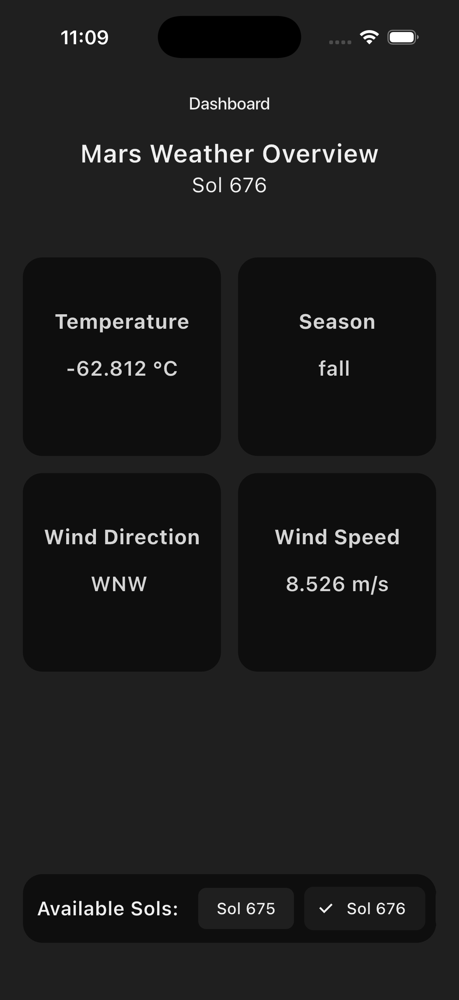
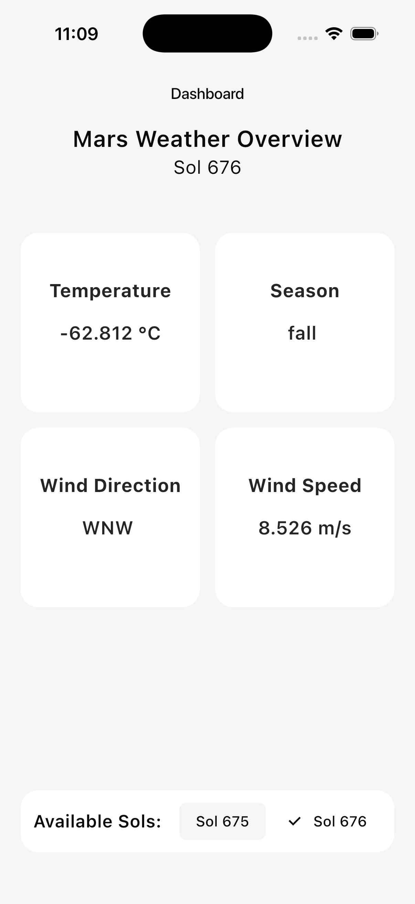

# Mars Weather Dashboard

A **Flutter mobile dashboard** for visualizing Mars weather data fetched from a custom Python backend API.

---

## 📌 About the Project

Mars Weather Dashboard is a **Flutter-based mobile application** designed to display Mars weather data in a clean and intuitive interface.

The app consumes data from a dedicated **Python backend service**, which handles fetching and processing data from NASA’s InSight API. This architecture keeps the frontend lightweight and focused on UI/UX.

---

## 🧠 Project Architecture

This project is part of a **two-repository system**:

- **Backend API**  
  [python-mars-weather](https://github.com/dimitrilahanas/python-mars-weather)  
  A **FastAPI service** that retrieves, processes, and exposes Mars weather data.

- **Frontend Dashboard (this repository)**  
  A **Flutter mobile app** that consumes the backend API and presents the data visually to the user.

---

## 🎯 Features

- Display the latest available Martian Sol
- Select a Sol to view detailed weather data:
  - Average temperature
  - Martian season
  - Wind direction
  - Wind speed
- Simple, mobile-friendly interface
- API-driven architecture (no direct NASA API calls from the app)
- Light and Dark theme support

---

## 🔧 Tech Stack

- **Flutter & Dart** – for cross-platform mobile app development
- **REST API** – for data consumption from the backend
- **FastAPI (backend)** – for serving Mars weather data

---

## 🛠 Code Structure

- **Models**
  - `DataModel` – represents individual weather metrics like temperature or wind speed.
  - `SolModel` – represents all weather data for a single Martian Sol.

- **Services**
  - `HttpServices` – handles HTTP requests to the backend API to fetch available Sols and their weather data.

- **Widgets**
  - `HomeScreen` – main dashboard screen with Sol selection and weather grid.
  - `SolHeader` – displays selected Sol number and header.
  - `SolSelector` – horizontal ChoiceChip list for selecting Sols.
  - `WeatherGrid` – displays weather metrics in a 2x2 grid.
  - `DataWidget` – individual metric display card.

- **Theme**
  - `DefaultTheme` – provides light and dark theme color schemes.

---

## ✅ Project Status

This project is **complete** and fully functional.

**Future improvements:**

- Refactor code for readability and maintainability

---

## 🏗 Screenshots

